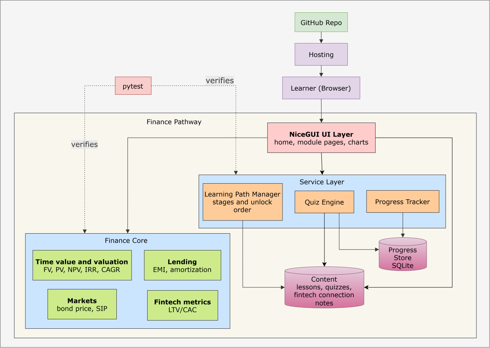

# Finance Pathway

A guided, interactive learning path for the finance knowledge you need to work in fintech, built in pure Python with [NiceGUI](https://nicegui.io).

> **Disclaimer:** This project is for educational purposes only and is not financial advice.

## Problem

Students who want to learn finance have no clear starting point or order to follow. Resources are scattered and jargon-heavy, and most are passive: you read about compound interest but never see how your own numbers change the outcome.

Finance Pathway gives learners a structured route through the essentials, with short lessons, interactive calculators, and quizzes, so they always know what to study next and can check their understanding. It is aimed at students targeting fintech and banking roles, so it focuses on how money moves, how it is priced, how risk is managed, and what regulators require.

## Features

- **Learning path:** 10 ordered modules across four stages, from fundamentals to fintech business models
- **Interactive calculators:** compound interest, EAR, NPV/IRR, EMI and amortization, bond pricing, SIP projection, LTV/CAC
- **Quizzes:** interview-style "Can you explain it?" questions at the end of each module
- **Fintech connection:** each module links the concept to real products
- **Progress tracking:** completed modules and quiz scores
- **Tested formulas:** all finance logic is unit-tested and independent of the UI

## Curriculum

Built around one question: *how much finance do you need to work in fintech?*
Enough to understand how money moves, how it's priced, how risk is managed, and what regulators require, because those are the things every fintech product touches.

### Stage 1: Money fundamentals (the language)
| Module | What you learn | Interactive tool |
|---|---|---|
| 1. Time value of money | PV/FV, compounding, effective rate, inflation, real returns | Compound interest and EAR calculator |
| 2. Cash flows and valuation | NPV, IRR, CAGR, discounting | NPV/IRR explorer |

### Stage 2: How the financial system works (the plumbing)
| Module | What you learn | Interactive tool |
|---|---|---|
| 3. Banking and ledgers | Accounts, deposits, double-entry bookkeeping, reconciliation | Mini double-entry ledger simulator |
| 4. Payments | Cards, UPI, ACH, wires/SWIFT; authorization, clearing, settlement; fees | Payment lifecycle walkthrough |
| 5. Lending and credit | EMI, APR vs interest rate, amortization, credit scores, underwriting, NPAs | EMI and amortization table |

### Stage 3: Markets and risk (the pricing)
| Module | What you learn | Interactive tool |
|---|---|---|
| 6. Capital markets | Equities, bonds, mutual funds/ETFs, derivatives basics, order lifecycle, T+1 settlement | Bond price vs yield |
| 7. Investing and portfolios | Risk vs return, diversification, SIP, asset allocation, robo-advisors | SIP and portfolio simulator |
| 8. Risk management | Credit, market, liquidity, operational and fraud risk; VaR intuition | Risk scenario quiz |

### Stage 4: Rules and business (the context)
| Module | What you learn | Interactive tool |
|---|---|---|
| 9. Regulation and compliance | KYC, AML, PCI-DSS, data privacy, RBI/global regulators, sandboxes | KYC flow quiz |
| 10. Fintech business models | Take rate, NIM, CAC, LTV, unit economics, embedded finance, BNPL | Unit economics calculator |

### Capstone
Pick a fintech (a UPI app, a lending startup, a robo-advisor) and write a one-page teardown: how it makes money, what risks it carries, and which regulations apply.

### Every module includes
1. A short lesson (10 minutes or less)
2. A calculator or simulator
3. A **"Fintech connection"** box: where the concept appears in real products
4. A **"Can you explain it?"** quiz: interview-style questions

## Architecture (tentative)



## Tech Stack

| Area | Choice |
|---|---|
| Language | Python 3.10+ |
| UI framework | NiceGUI |
| Data / maths | pandas, numpy |
| Charts | Plotly |
| Storage | SQLite (planned) |
| Testing | pytest |

## Project Structure

```
finance-pathway/
├── main.py                 # app entry point (planned)
├── app/
│   ├── pages/              # one file per module page
│   ├── components/         # reusable UI pieces (calculator,card, quiz)
│   └── services/           # quiz engine, progress tracking, path manager
├── core/
│   ├── __init__.py
│   └── calculations.py     # pure finance formulas (no UI code)
├── content/                # lessons and quiz questions
├── tests/
│   └── test_calculations.py
├── pytest.ini
├── requirements.txt
└── README.md
```

## Getting Started

```bash
git clone https://github.com/LithikhaB/finance-pathway.git
cd finance-pathway
python -m venv .venv
.venv\Scripts\activate          # Windows
pip install -r requirements.txt
python main.py
```

Then open http://localhost:8080.

## Running Tests

```bash
pytest
```


## License

MIT