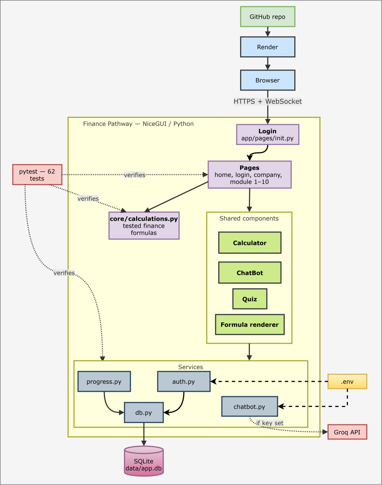

# Finance Pathway

A guided, interactive learning path for the finance knowledge you need to work in fintech, built in pure Python with [NiceGUI](https://nicegui.io). Includes 10 modules with live calculators and quizzes, persistent accounts and progress, an AI chatbot, and a company-lookup tool.

> **Disclaimer:** This project is for educational purposes only and is not financial advice.

## Problem

Students who want to learn finance have no clear starting point or order to follow. Resources are scattered and jargon-heavy, and most are passive: you read about compound interest but never see how your own numbers change the outcome.

Finance Pathway gives learners a structured route through the essentials, with short lessons, interactive calculators, and quizzes, so they always know what to study next and can check their understanding. It's aimed at students targeting fintech and banking roles, focusing on how money moves, how it's priced, how risk is managed, and what regulators require.

## Features

- **10-module curriculum**, ordered across four stages, each with a lesson, an interactive calculator or simulator, a "fintech connection" note, and an interview-style quiz
- **Accounts and persistent progress** — SQLite-backed login (hashed passwords), quiz scores kept per user across sessions
- **On-screen calculator** — appears automatically when a quiz scrolls into view, draggable, with active-operator highlighting
- **AI chatbot** — a floating, draggable chat widget answering finance questions, backed by Groq's API when configured, with a built-in FAQ fallback when it isn't
- **Company lookup** — enter a company name (Citigroup, Stripe, Paytm, etc.) and get a two-paragraph explanation of what it does and how it moves money, same Groq/fallback pattern
- **Tested finance core** — every formula lives in `core/calculations.py`, independent of the UI, with unit tests verified against known values
- **62 automated tests** covering formulas, page rendering, auth, and the chatbot

## Curriculum: Finance Knowledge for a Fintech Career

Built around one question: *how much finance do you need to work in fintech?* Enough to understand how money moves, how it's priced, how risk is managed, and what regulators require, because those are the things every fintech product touches.

### Stage 1: Money fundamentals
| Module | Topic | Interactive tool |
|---|---|---|
| 1 | Time value of money — PV/FV, compounding, EAR, inflation | Compound interest & EAR calculator |
| 2 | Cash flows and valuation — NPV, IRR, CAGR | NPV/IRR/CAGR explorer |

### Stage 2: How the financial system works
| Module | Topic | Interactive tool |
|---|---|---|
| 3 | Banking and ledgers — double-entry bookkeeping, reconciliation | Ledger simulator |
| 4 | Payments — authorization, clearing, settlement | Payment lifecycle tracer |
| 5 | Lending and credit — EMI, APR, amortization | EMI & amortization chart |

### Stage 3: Markets and risk
| Module | Topic | Interactive tool |
|---|---|---|
| 6 | Capital markets — equities, bonds, derivatives, settlement | Bond price vs. yield |
| 7 | Investing and portfolios — diversification, SIP | SIP growth simulator |
| 8 | Risk management — credit/market/liquidity/operational/fraud risk, VaR | Value at Risk calculator |

### Stage 4: Rules and business
| Module | Topic | Interactive tool |
|---|---|---|
| 9 | Regulation and compliance — KYC, AML, PCI-DSS, sandboxes | KYC flow tracer |
| 10 | Fintech business models — take rate, LTV, CAC | Unit economics calculator |

## Architecture


## Getting Started

```bash
git clone https://github.com/<your-username>/finance-pathway.git
cd finance-pathway
python -m venv .venv
.venv\Scripts\activate          # Windows
pip install -r requirements.txt
cp .env.example .env            # then fill in your own values (see below)
python main.py
```

Then open http://localhost:8080. You'll land on the login page — create an account (any username/password; it's a demo auth system, not a real identity provider) and you're in.

## Environment Variables

Set these in `.env` locally, or in your hosting platform's dashboard when deployed (never commit real values — `.env` is gitignored, `.env.example` is the committed template).

| Variable | Required | Purpose |
|---|---|---|
| `GROQ_API_KEY` | No | Enables real AI answers in the chatbot and company lookup. Without it, both fall back to a built-in FAQ. Get a free key at [console.groq.com/keys](https://console.groq.com/keys). |
| `GROQ_MODEL` | No | Overrides the default model (`openai/gpt-oss-20b`). Check which models your key can access with `client.models.list()`. |
| `STORAGE_SECRET` | Yes (for deployment) | Signs the browser session cookie. Use a long random string in production — never the default. |
| `PORT` | No | Set automatically by most hosting platforms; defaults to `8080` locally. |
| `FINANCE_PATHWAY_DB` | No | Overrides the SQLite file path. Used automatically by the test suite to avoid touching your real database. |

## Running Tests

```bash
pytest
```

All 62 tests should pass. This checks the finance formulas against known values, that every page renders, that login/signup/logout work, and that the chatbot's fallback and markdown-stripping behave correctly.


**Known limitation:** Render's free tier does not support attached persistent disks, so the SQLite database (`data/app.db`) is not guaranteed to survive a redeploy or a cold start after inactivity. This is fine for a demo but not for real users. To fix it properly, swap `app/services/db.py` for a free external database (e.g. Turso for SQLite-compatible storage, or Neon/Supabase for Postgres) that isn't tied to the compute instance's local disk.

## Security Notes

This is a portfolio project, not a production identity system:
- Passwords are hashed (PBKDF2-SHA256, per-user random salt, 200,000 iterations) — a real improvement over plain text, but there's no rate limiting, no password reset flow, and no email verification.
- `STORAGE_SECRET` must be changed from its default before any public deployment; it signs the session cookie that keeps you logged in.
- The chatbot's fallback path never leaks the Groq API key or makes any external call when no key is configured.


## License

MIT